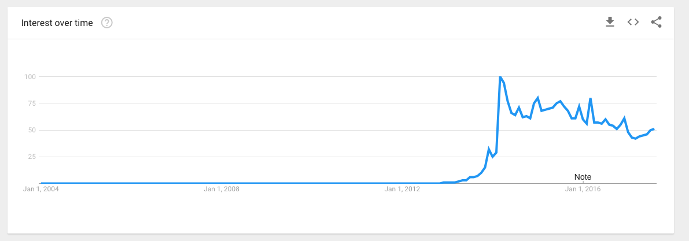

# selfies

## Goal:

It seems, in my very anecdotal experience, that fewer people are taking selfies of late, as compared to the past few years. This perhaps makes sense...selfie's grew in prominence with rise of mobile phone forward facing cameras, which probably come into mainstream a few years ago. Maybe now they are less novel, or kinda lame? What is the history of the selfie? Let's see if we can get a sense of how many selfies are being taken now. Ideally, we could compare this to the number of selfies taken in the past.

